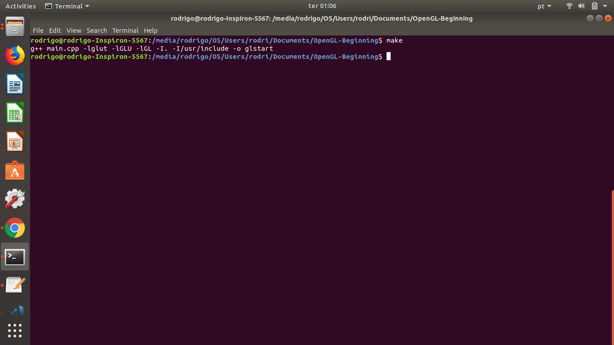

# Module - OpenGL-Beginning

<p> This module has a simple application, just to understand how openGl and its libraries work.</P>
<p> OpenGl is a standard application programming interface(API) with cross-language and cross-platform features for rendering 2d and 3d applications.</p>
<p> OpenGl is responsible in most cases for drawing content on window using primitives(polygon triangles points quadrilateral,...)</p>
<p> Where for these graphic contents, It is necessary to use utilities for openGl to allow some behaviours, like: window definition, window control and monitoring of keyboard and mouse input.</p>
<p> Thus, one toolkit that makes it, is GLUT(OpenGL Utility Toolkit) that is labrary utilities for openGl.</p>
<p> However GLUT is a not openSource tool, then, instead of using GLUT, in this and others projects in this repository, will be used freeglut.</p>


### How to run it?

<p> After making sure what is openGL, GLUT and what you need to install on your computer to run this application(that is: OpenGL | Free-Glut | G++), let's start.</p>
<p> Open your terminator, go to the folder OpenGL-Beginning and type the following command: </p>

```
make
```

<p align="center">
	<br>
	
	<h5 align="center">Figure 1 - Make Command</h5>
	<br>
</p>

<p> After this, run the generated object file using the command:</p>

```
./glstar
```
<p align="center">
	<br>
	
	<h5 align="center">Figure 1 - Result</h5>
	<br>
</p>

## Contributors

* Rodrigo Gonçalves Daniel ([RodrigoGonçalvesDaniel](https://github.com/rodrigogoncalves123/)) rodrigodaniel@cc.ci.ufpb.br

>Created By **[RodrigoGonçalvesDaniel](https://www.linkedin.com/in/rodrigo-gon%C3%A7alves-daniel-9a2736110/)** 2018.
