# Module - cg_framework
---
Portuguese version:

## Algoritmos para a rasterização de pontos e linhas

## Menu


### Introdução


<p> Este trabalho tem como finalidade mostrar o funcionamento de algoritmos de rasterização para desenhar linhas e formar um polígono de três lados, neste trabalho foi utilizado um Framework que simula o acesso direto a memória de vídeo com experimentos feitos no terminal do ubuntu e em uma IDE de nome codeblocks.</P>

### Rasterização 


<p> Rasterização é o processo de conversão entre representações vetorial e matricial. Os gráficos basicamente são definidos como primitivas geométricas como por exemplo um polígono, neste trabalho vamos fazer a conversão de uma primitiva para um dispositivo gráfico representado em pixels.</p>

#### Criando um pixel na tela(Rasterização de um ponto)

<p> Os monitores raster utilizam pixels que são representados em uma matriz de linhas e colunas e cada pixel está associado a memória. Cada pixel contem 4 bytes e esses bytes vão representar o RGBA, para encontrar os endereços de memória utilizamos o offset, o offset foi utilizado para criar a função do PutPixel. A formula para o offset é a seguinte: OFFSET = 4*X + 4*Y*W onde  x é a linha, y é a coluna e w é a quantidade total de colunas.</p> 


<p align="center">
	<br>
	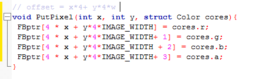
	<h5 align="center">Figure 1 - Código do Pixel</h5>
	<br>
</p>

<p align="center">
	<br>
	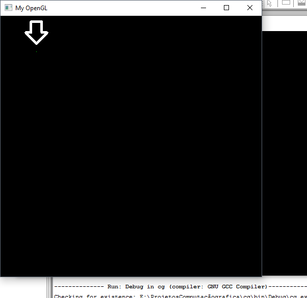
	<h5 align="center">Figure 2 - Um pixel na tela tela</h5>
	<br>
</p>

<p align="center">
	<br>
	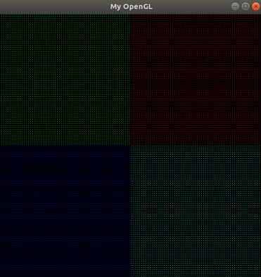
	<h5 align="center">Figure 3 - Feixe de pontos</h5>
	<br>
</p>


#### Rasterização de uma linha:

<p>O algoritmo do DDA, desenha a reta a partir de calculos interativos envolvendo operações de soma conforme segue a imagem do algoritmo abaixo:</p>

<p align="center">
	<br>
	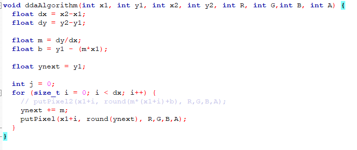
	<h5 align="center">Figure 4 - Algorito da reta DDA</h5>
	<br>
</p>

<p>Porém, como o algoritmo do DDA tem uma perda de desenpenho já que é preciso aplicar uma função aproximação a cada desenho de um pixel na tela, usaremos o algoritmo de bresenham.</p>

<p>  O algoritmo de bresenham é um método utilizado para desenhar linhas utilizando pixels. Para criar a função DrawLine foi utilizado o algoritmo de Bresenham, neste blog vou mostrar como funciona o algoritmo de bresenham que utilizei para fazer o drawline. Observação: A solução abaixo só serve para o 1 octante, ou seja, a inclinação da linha traçada ou segmento de reta vai ser entre 0 e 45 graus.</p> 

##### 1. Primeiro passo temos que ter as entradas, exemplo: 
<p> Imagine que essa imagem é a tela de um computador e que cada quadrinho são os pixels que podem ser pintados. </p> 

<p align="center">
	<br>
	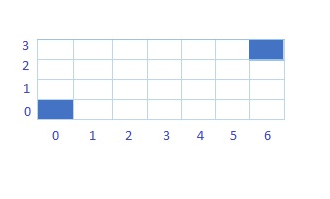
	<h5 align="center">Figure 5</h5>
	<br>
</p>

<p> As Coordenadas (0,0), o primeiro zero é a coordenada inicial do eixo X¹ e o segundo zero a coordenada inicial do eixo Y¹, e as coordenadas 6 e 3 são as coordenadas finais para o eixo X² e Y². Para que o Bresenham funcione é necessário que estas coordenadas sejam dadas para função que vai desenhar a linha com pixels. </p> 

##### 2. Segundo passo: vamos definir as fórmulas que vão ser utilizadas para calcular a variável de decisão e  as variáveis auxiliares.

<p> Para podermos calcular a variável de decisão precisamos fazer uma subtração de coordenadas obtendo um delta Y e um delta X, exemplo: </p> 

<p> Para podermos calcular a variável de decisão precisamos fazer uma subtração de coordenadas obtendo um delta Y e um delta X, exemplo: </p>

```
 DeltaY = Y2 - Y1 e   
 DeltaX = X2 - X1
```

<p> O Algoritmo de Bresenham é baseado em decisões, onde os valores das decisões decidem se vai incrementar em X ou em X e Y a partir de valores positivos e negativos. Agora para obtermos a variável de decisão temos o seguinte cálculo: </p>

```
VariavelDeDecisao = 2*DeltaY - DeltaX
```

<p> Para calcular as variáveis auxiliares também usamos os valores de Delta, obtemos a seguinte fórmula: </p>

##### 3. Terceiro passo é verificar se o parâmetro de decisão é positivo ou negativo:

<p> Se o parâmetro de decisão for > 0(positivo), então pegamos o ValorDeDecisão calculado e jogamos na fórmula:</p>

```
ValorDeDecisão + 2*DeltaY - 2*DeltaX
```

<p> Se o parametro de decisão for < 0(negativo), então pegamos o  ValorDeDecisão calculado e jogamos na fórmula: </p>

```
ValorDeDecisão + 2*DeltaY
```

<p> Estes valores positivos e negativos servem para saber quais pixels iremos acessar com o objetivo de formar uma reta.</p>

##### Exemplo:

<p> Entradas: (0,0) e (7,4) ,então o DeltaX = 7-0 = 7, e o DeltaY= 4 - 0 = 4 ,supondo que temos essa entrada e queremos traçar uma linha.</p>

<p align="center">
	<br>
	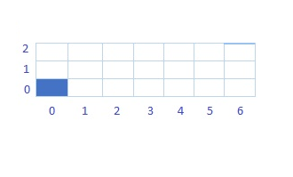
	<h5 align="center">Figure 6</h5>
	<br>
</p>

<p align="center">
	<br>
	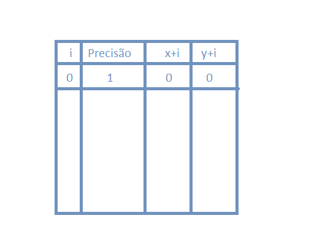
	<h5 align="center">Figure 7</h5>
	<br>
</p>

##### 1. Para calcular a primeira precisão temos o seguinte cálculo: 

```
Precisão = 2*DeltaY - DeltaX
```

```
Precisão = 8-7
```

```
Precisão = 1
```

##### 2. Para calcular a primeira iteração precisamos saber se é negativo ou positivo o resultado da precisão: 

##### 3. Em seguida para os resultados das próximas precisões se for positiva sempre utilizamos:

```
P=  ResultadoDaPrecisão + 2*DeltaY - 2*DeltaX
```

```
P= 1 + 8 - 14
```

```
P= -5 
```

##### 4. Note que o resultado foi negativo, então sempre que o  resultado for negativo aplicamos a fórmula:

```
P = ResultadoDaPrecisão + 2*DeltaY
```

```
P = -5 + 8 
```

```
P =  3
```

##### 5. Se o resultado for positivo incrementamos em X e Y, se o resultado for negativo incrementamos apenas em X:

<p align="center">
	<br>
	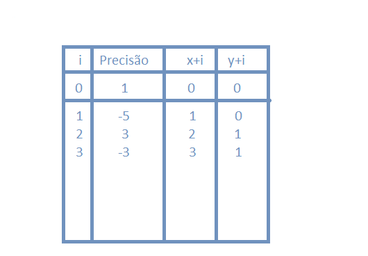
	<h5 align="center">Figure 8</h5>
	<br>
</p>

<p>Segue abaixo como seria até a 4 iteração:</p>

<p align="center">
	<br>
	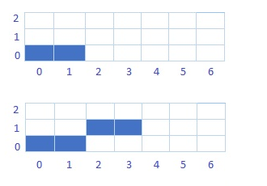
	<h5 align="center">Figure 9</h5>
	<br>
</p>

<p>
Este exemplo foi feito utilizando o bresenham de primeiro octante, foi utilizado no exemplo abaixo uma variação do bresenham que é chamado de algoritmo do ponto médio para traçar a linha abaixo.
</p>

<p align="center">
	<br>
	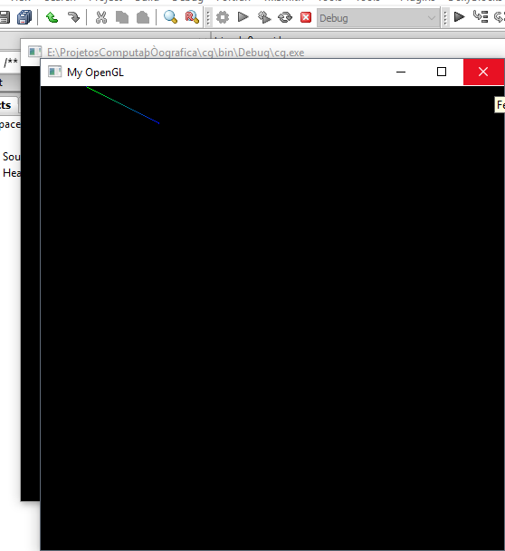
	<h5 align="center">Figure 10 - Desenho da linha no primeiro octante</h5>
	<br>
</p>

<p>Para formar o triângulo foi algo simples, basta criar uma função que chame o Drawline  3 vezes dentro de uma função criada. Tive alguns problemas para montar este triângulo com o Drawline que funciona apenas para o 1 octante. No final obtive o seguinte resultado:</p>

<p align="center">
	<br>
	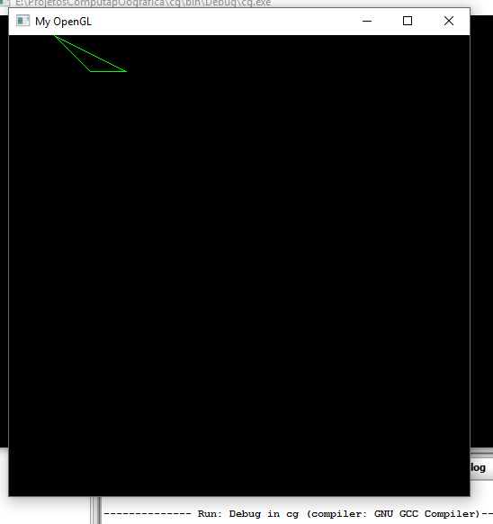
	<h5 align="center">Figure 11 - Formando um triângulo com o Drawline(bresenham) apenas no primeiro octante</h5>
	<br>
</p>

### Interpolação linear

<p>Dados os pontos (0,0) e (512,512), a interpolante linear é a linha entre os dois pontos. O Bresenham do ponto médio foi utilizado para formar essa linha que tem apenas uma cor.</p>

<p align="center">
	<br>
	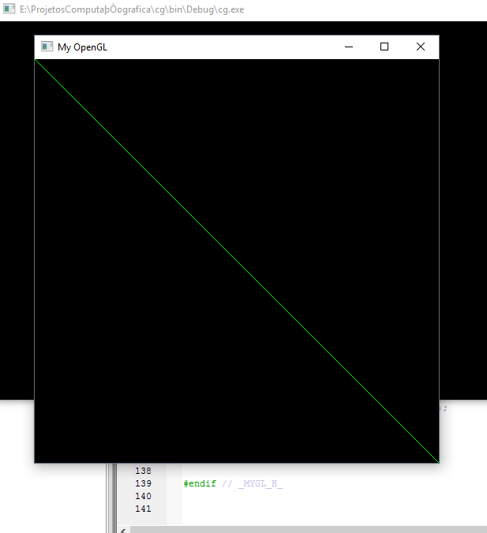
	<h5 align="center">Figure 12</h5>
	<br>
</p>

### Interpolação de cores

<p> Abaixo temos um triângulo com interpolação de cores entre Azul e Vermelho. Para calcular a variação de cores fazemos uma diferença de cores final pelo inicial e dividimos pelo Delta do problema, logo em seguida incrementamos a cor para cada pixel pintado com essa diferença. Tive problemas para colocar 3 cores ao mesmo tempo, então deixei a variação de cores entre duas cores apenas.</p>

<p align="center">
	<br>
	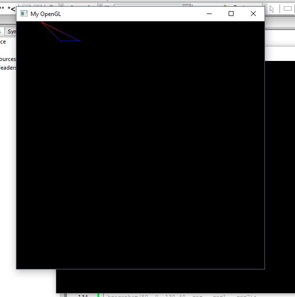
	<h5 align="center">Figure 13 - Triângulo com interpolação de cores</h5>
	<br>
</p>

<p align="center">
	<br>
	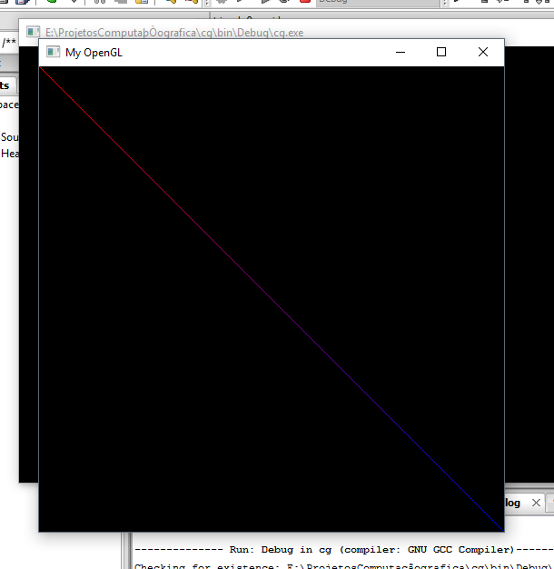
	<h5 align="center">Figure 14 - Linha interpolada com variação de cores entre Azul e Vermelho</h5>
	<br>
</p>

<p align="center">
	<br>
	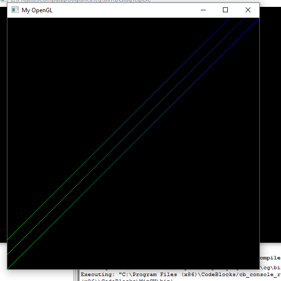
	<h5 align="center">Figure 15 - Linha interpolada com variação de cores entre Azul e Verde</h5>
	<br>
</p>

### Bresenham para todos os octantes

<p>Esse Bresenham serve para generalizar todos os octantes. Para criar a função de generalização  precisamos de outras funções que auxiliam essa generalização como por exemplo a função de troca de variáveis, ela é muito útil para fazer simples mudanças. Nesta função de generalização também foi utilizado variáveis que vão atuar como booleanos, onde o 1 vai representar true e o 0 vai representar o false, ou seja, vamos precisar de sinalizadores para dizer quando vamos precisar inverter eixos ou mudar variáveis.  Para criar a generalização precisamos fazer espelhamentos e inversões tendo como base os deltas para ter está noção. Exemplo:</p>

<p align="center">
	<br>
	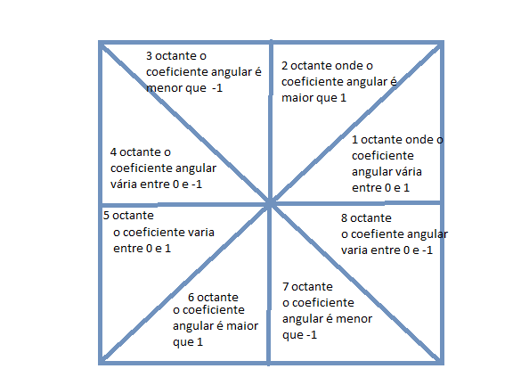
	<h5 align="center">Figure 16 - octantes</h5>
	<br>
</p>


<p align="center">
	<br>
	
	<h5 align="center">Figure 17 - parte do código da generalização dos octantes</h5>
	<br>
</p>


<p align="center">
	<br>
	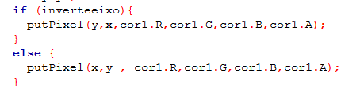
	<h5 align="center">Figure 18 - parte do código da generalização dos octantes</h5>
	<br>
</p>


<p align="center">
	<br>
	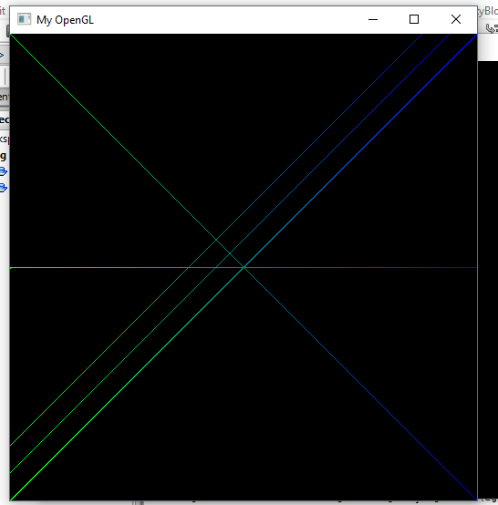
	<h5 align="center">Figure 18 - Imagem  generalizada em todos os octantes com cores interpoladas entre azul e verde</h5>
	<br>
</p>

<p align="center">
	<br>
	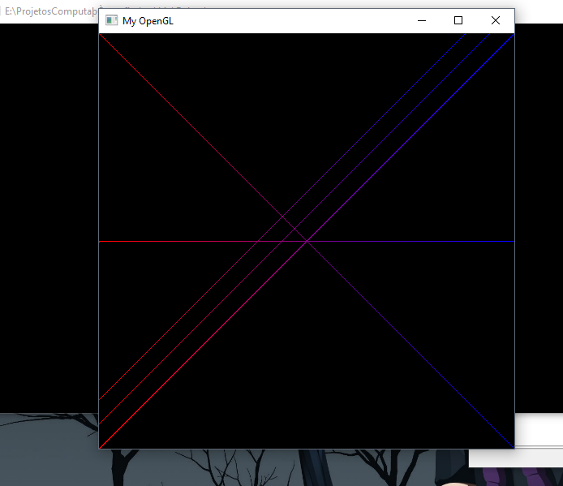
	<h5 align="center">Figure 19 - Imagem  generalizada em todos os octantes com cores interpoladas entre azul e vermelho</h5>
	<br>
</p>


<p align="center">
	<br>
	
	<h5 align="center">Figure 19 - Imagem  generalizada em todos os octantes com cores interpoladas entre azul e vermelho</h5>
	<br>
</p>


<p align="center">
	<br>
	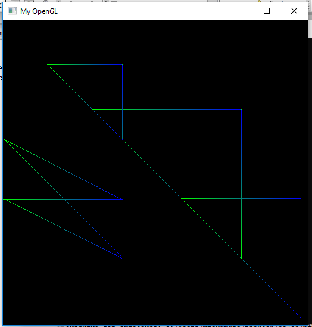
	<h5 align="center">Figure 20 - sequencia de triângulos</h5>
	<br>
</p>


### Principais Dificuldades

1. A primeira dificuldade encontrada foi resolver o Bresenham no papel.
2. Rodar o OpenGl no windows, tive alguns problemas na instalação do OpenGL + Codeblocks.
3. Problemas para entender e implementar a generalização de todos os octantes.
4. Problemas para rodar o framework no windows levando-nos a usar o Ubuntu. 

### Possíveis melhoras

1. Código em Java ou Python ficaria mais fácil de manipular e bem melhor de entender. 
2. Um framework que já tivesse as adaptações para rodar no windows, um amigo passou vários dias para conseguir rodar algo assim, entre outras pessoas. 
3. Os alunos de ciência da computação não possuem tanta experiência em linguagem C, um framework que está mais ligado nas novas linguagens do mercado seria mais fácil de fazer o código.

### Possíveis melhoras

1. Livro  Computer Graphics With OpenGL hearn baker
2. http://www.univasf.edu.br/~jorge.cavalcanti/comput_graf04_prim_graficas2.pdf
3. Problemas para entender e implementar a generalização de todos os octantes
4. https://marciobueno.com/arquivos/ensino/cg/CG_03_Primitivas_Graficas.pdf. 


## Contributors

* Rodrigo Gonçalves Daniel ([RodrigoGonçalvesDaniel](https://github.com/rodrigogoncalves123/)) rodrigodaniel@cc.ci.ufpb.br

>Created By **[RodrigoGonçalvesDaniel](https://www.linkedin.com/in/rodrigo-gon%C3%A7alves-daniel-9a2736110/)** 2018.