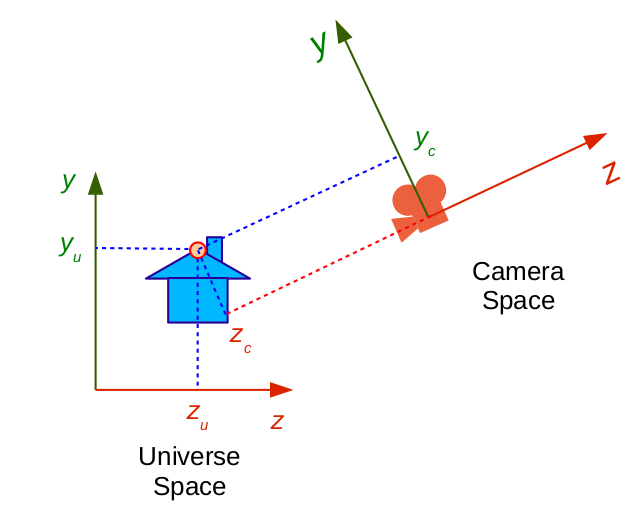

# Module - Graphic Pipeline
---
Portuguese version:

## Menu

### Introdução

 O Pipeline Gráfico é uma sequência de passos necessários para transformar uma descrição geométrica de uma cena 3D em uma descrição visual em uma tela 2D, ou seja, cada passo do pipeline consiste de uma transformação geométrica de um sistema de coordenadas para outro sistema de coordenadas.

	 
	
	<h5 align="center">Figure 1 - Pipeline Gráfico</h5>
	 

### Transformações do Pipeline 

 O objetivo é implementar transformações que levaram os vértices do espaço do objeto para o espaço tela.

#### Transformação do espaço do objeto para o espaço do universo:

 O primeiro passo é a passagem de vértices do espaço do objeto para o espaço do universo. O espaço do objeto é onde cada objeto que foi criado e modelado a partir de suas primitivas geométricas utilizando o seu próprio sistema de coordenadas. Espaço do universo é responsável por conter todos os objetos da cena.
 

	 
	
	<h5 align="center">Figure 2 - Transformação do espaço do objeto para o espaço do universo</h5>
	 

Para essa transformação é necessária a multiplicação dos vértices por uma matriz denominada model matriz, essa matriz é composta por uma sequência de transformações geométricas que levam do espaço do objeto para o espaço do universo. A construção da Matriz Model é feita a partir de transformações dos pontos do espaço do objeto para o espaço do universo, para transportar pontos do espaço do objeto para o espaço do universo, nós precisamos utilizar transformações geométricas sobre cada ponto desta matriz. 

#### Rotação:

A rotação no espaço 2D, a rotação ocorre em torno da origem do sistema de coordenadas e no espaço 3D representa rotacionar os vértices de um objeto a partir de um ângulo dado, se o ângulo for positivo, a rotação ocorre no sentido anti-horário, mas se o ângulo for negativo, a rotação ocorre no sentido horário.

	 
	
	<h5 align="center">Figure 3 - Rotação do espaço 2d</h5>
	 

	 
	
	<h5 align="center">Figure 4 - Matriz de rotação do espaço 2d</h5>
	 

#### Translação:

A translação é resolvível com coordenadas homogêneas com w=1 e valores de SI( i = 1, .... , N) é a dimensão do objeto a ser transladado incluindo no formato de matriz a seguir para o caso de n=3.

	 
	
	<h5 align="center">Figure 5 - Utilizando coordenadas homogêneas</h5>
	 

#### Escala:

Os termos do diagonal principal da matriz de transforma¸c˜ao produzem a mudan¸ca de escala. Se multiplicarmos um ponto ˙ P = (Px,Py,Pz,Pw) pela matriz Ea,b,c abaixo, a coordenada Px ser´a multiplicada por a, Py por b e Pz por c.

	 
	
	<h5 align="center">Figure 6 - Matriz escala</h5>
	 

#### Shear:

Uma forma de desfigurar os objetos de uma cena seria aplicando esta transformação. O shear  mantém uma coordenada U fixa enquanto muda a coordenada V ao longo de seu eixo.

	 
	
	<h5 align="center">Figure 7 - Shear em X</h5>
	 

### Espaço do Universo para o espaço da câmera

Primeiro procedimento é colocar a câmera em algum lugar do universo ,  um vetor up para colocar a câmera no espaço, um vetor direção para que mostre para onde a câmera está olhando. Definido os elementos iremos criar um novo sistema de coordenadas para o espaço da câmera utilizando produto de vetores e normalização de vetores. 

	 
	
	<h5 align="center">Figure 8 - espaço da câmera e espaço do universo</h5>
	 

	 
	
	<h5 align="center">Figure 9 - Posição da câmera, vetor direção e UP.
</h5>
	 

Fazendo o cálculo também dos eixos X, Y e Z,  definimos uma matriz, como foi feito no primeiro passo, que leve os vértices do espaço universo para o espaço da câmera, essa matriz é chamada  (view matrix) onde é combinado uma translação e rotação. A matriz view e a matriz model podem ser combinadas formando uma única matriz chamada de  matriz modelview.

	 
	
	<h5 align="center">Figure 10 - Matriz view é o produto dessas duas matrizes
</h5>
	 

### Espaço da câmera para o espaço de recorte

Esse passo  tem como objetivo transformar os vértices do espaço da câmera para o espaço de recorte para construir uma nova matriz chamada de matriz de projeção.

	 
	
	<h5 align="center">Figure 11 - Projeção pespectiva do view plane
</h5>
	 

	 
	
	<h5 align="center">Figure 11 - Calcula da Projeção pespectiva do view plane
</h5>
	 

O ponto ‘p’ da imagem acima representa um vértice genérico de um objeto no espaço da câmera. Esse ponto é projetado sobre um plano (o view plane) que combina com o eixo Y gerando um p’ que contém um y’ como coordenada, o ponto ‘c’ é a localização da câmera, ‘d’ representa a distância entre a câmera e o view plane.

O EM CONSTRUÇÃO.

## Contributors

* Rodrigo Gonçalves Daniel ([RodrigoGonçalvesDaniel](https://github.com/rodrigogoncalves123/)) rodrigodaniel@cc.ci.ufpb.br

* Alexandre Cesar ([Alexandre Cesar]) alexandre.f.cesar@gmail.com

>Created By **[RodrigoGonçalvesDaniel](https://www.linkedin.com/in/rodrigo-gon%C3%A7alves-daniel-9a2736110/)** 2018.
